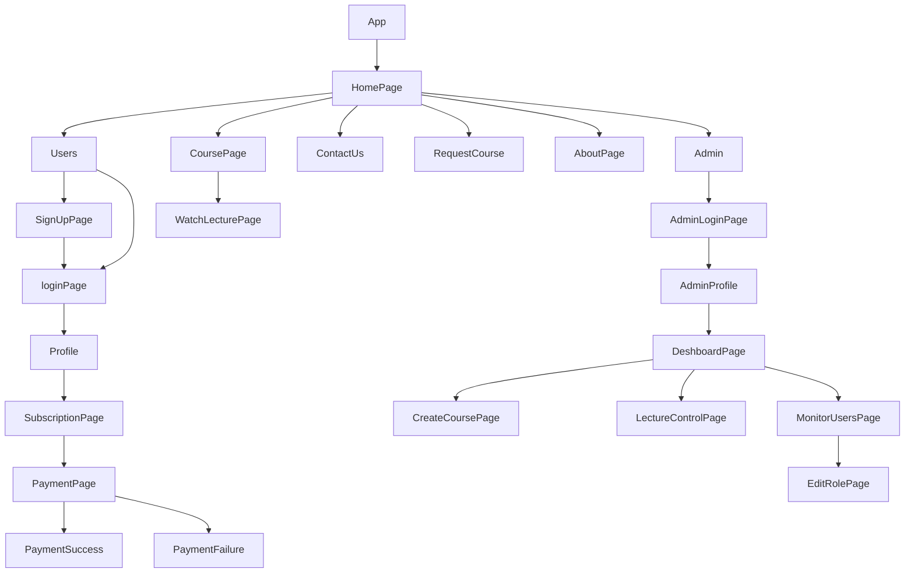

> 💻 PROJECT NAME ✨ => Course App💻
 

---

> ✨ABOUT Project AND THEIR RULES🧑‍💻

⬇️To access the application, please follow these steps:

⭕ Start the Backend Server:
Open your terminal and navigate to the backend directory of the project. Use the following command to start the backend server:

  ✨ npm run dev
   
This command will initialize the backend server, allowing it to handle incoming requests.

⭕ Start the Frontend Application:
Open another terminal window and navigate to the frontend directory of the project. Use the following command to start the frontend application:

   ✨npm start
  
Once executed, the frontend application will be accessible at http://localhost:3000 in your web browser.

⭕ User Registration and Login:
You can sign up as a user by providing your registration details. Additionally, you can log in as an administrator, but please note that the administrator credentials are hardcoded. The credentials are as follows:

   - Name:abc123
   - Email: abc123@gmail.com
   - Password: 123456

⭕ User Functionality:
As a user, you have access to various features, including viewing and editing your profile. You can also access all available courses after subscribing and making payments through the integrated Razorpay payment gateway.

⭕ Admin Functionality:
Administrators have similar access to user features but cannot purchase subscriptions since they already have administrative privileges. Admins have a separate dashboard where they can monitor user activity, add, delete, and edit courses and lectures, and change user roles.

This application provides a seamless experience for both users and administrators, allowing them to interact with courses and manage user-related tasks efficiently.

Please note that for security reasons, it's essential to use strong and unique passwords and avoid hard-coding sensitive credentials in a production environment. Additionally, consider implementing authentication and authorization mechanisms to enhance the security of your application.

## 🔗 Profile Links✨

 | Collaborators| Resume | Github                                                                                                                         |Linkedin                                                                                                                                                            | Portfolio                                                                                                                                    |
| -------------| ------------- | ---------------------------------------------------------------------------------------------------------------------------------------- | ------------------------------------------------------------------------------------------------------------------------------------------------------------------- | -------------------------------------------------------------------------------------------------------------------------------------------- |
| Shikha Gupta |  | |  | |  

  ---
## 💫Tech-Stack->

- #### For Frontend:-
   - `HTML5`
  - `CSS3`
  - `JavaScript `
   - `Redux`
  - `ReactJS`
   - `ES6 `

- #### For Backend:-
   - `NodeJS`
   - `ExpressJS`
    - `MongoDB `
- #### For deploy database:- 
    
    - `Render`

- #### For Styling:-  
   - `Chakra UI `
   

- #### For live Project: -
   - `Vercel`
   
## ⭕Steps to run our Project :

✨Clone the repository.

✨Run the command `npm install` in both the frontend and backend folders.

✨Run the command `npm run server` in the backend folder.

✨Run the command `npm start` in the frontend folder run on localhost:3000.

---
## Features ✨:-
---
 | Serial No            | Feature                                                              |
| ----------------- | ------------------------------------------------------ |
| 1 | User signup and Login, Profile Page for User |
| 2 | Home Page, To request a course |
| 3 | Course page, search & filter course, about page  |
| 4 | Watch lecture Page, Add to playlist |
| 5 | Contact page, toggle for dark and light mode |
| 6 | sidebar, footer, completely Responsive |
| 7 | views count, monitor subscriber growth, monitor views growth  |
| 8 | Profit tracking  subscribe and unsubscribe graph |
| 9 | Upload course, delete course, edit course  |
| 10 | Upload lecture, delete lecture, edit lecture, edit role|
| 11| Edit profile, forget the password, reset the password, use of nodemailer |
| 12 |progress bar, Admin login, Profile Page for Admin |
| 13 | User and admin logout, Dashboard Page  |
| 14| Razorpay integration, buy a subscription for using Razorpay |
| 15 | navbar, footer, completely Responsive |
| 16 | Demo video, about the game and rules  |

---
# Package.json(Dependency)✨:-

 | Serial No            | Backend                      |  Frontend      |
| ----------------- | -------------------|--------------------- |
| 1 | bcrypt |   Chakra-ui  |
| 2 | mongoose |  React Router dom |
| 3 | cors | redux  |
| 4 | dotenv |  react redux |
| 5 | express | chartjs |
| 6 | jsonwebtoken | redux thunk |
| 7 | cloudinary | react-hot-toast |
| 8 | cookie-parser |  react-chartjs-2 |
| 9 | datauri |  protected-route-react |
| 10 | node-cron | react-icons |
| 11 | multer |   axios |
| 12 | nodemailer | react-dom |
| 13 | razorpay | react |
| 14 | validator | react-toolkit |

---

## Flow

---
## Screenshots 📷
---                                     
                                                                                                                          
                                                                                                                          
                                                                                                                     
                                                                                                                          
                                                                                                                          
                                                                                                                          
                                                                                                                          
                                                                                                                          

---

<h1 align="center">✨Thank You✨</h1>
